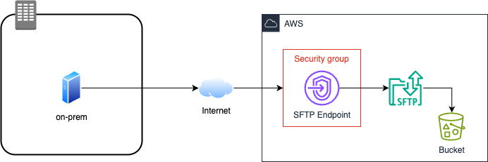

# AWS SFTP Server Terraform Module

This Terraform module provisions an AWS SFTP server using AWS Transfer Family, along with associated resources required for a fully managed and secure SFTP solution on AWS.

## Overview

This module automates the creation and management of an SFTP server on AWS, leveraging AWS Transfer Family. It is designed to make it easy to deploy a robust, secure, and scalable SFTP solution with minimal effort. The module handles the provisioning of the transfer server itself, as well as supporting resources such as IAM roles, user management, logging, and optionally, backend storage (S3 or EFS).

## Features

- **Creates an AWS Transfer Family (SFTP) Server:** Fully managed, scalable SFTP endpoint.
- **User Management:** Optionally creates users and attaches IAM roles for access control.
- **Integration with S3 or EFS:** Choose between Amazon S3 buckets.

- **Custom Domain Support:** Optionally attach a custom hostname using AWS Route 53.

- **Logging:** Enables CloudWatch logging for monitoring SFTP activity.

- **Security Controls:** Configurable security policies, VPC integration, and endpoint type (public).
- **Tagging:** Supports resource tagging for cost allocation and organization.

- **Architecture Diagram:**
  
